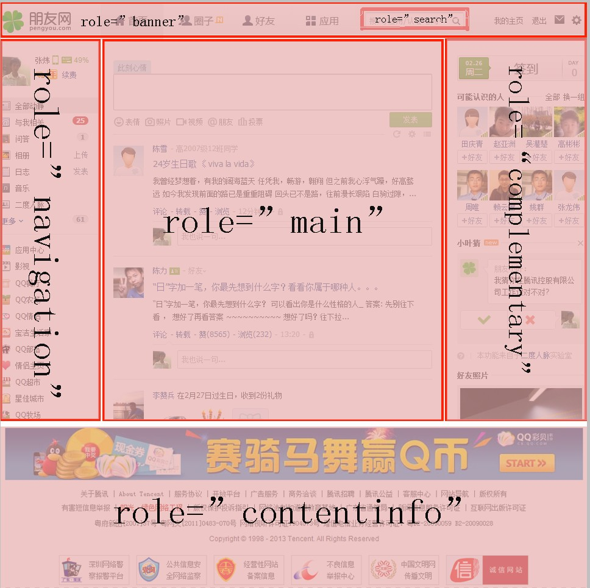
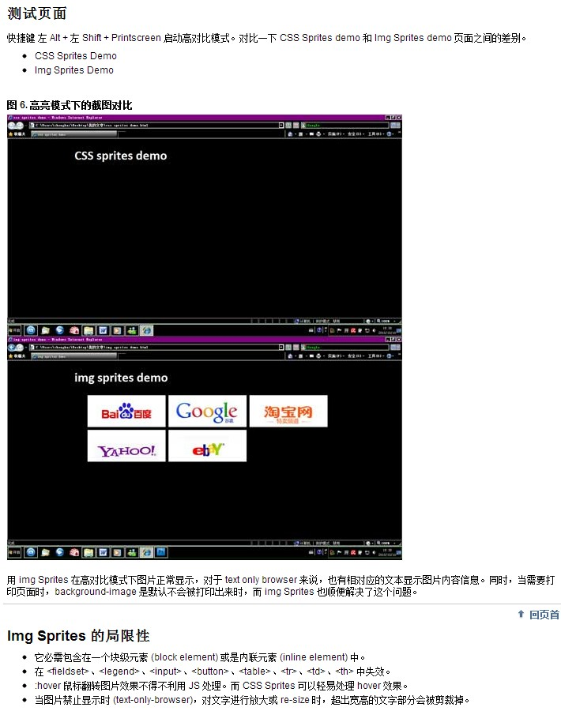
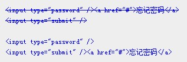

<section id="buttonGroups">
  

    <h1><a href="http://baike.baidu.com/view/1271302.htm" target="_blank">读屏软件</a></h1>
  

  

    

      <h3>现状</h3>
      
1. 国内的用户使用争渡，永德读屏软件的占大多数，国外主要是jaws，nvda，但是上面4个只有nvda是开源免费的。

      
2. 在公司一般做测试是使用<a href="http://www.nvda-project.org/" target="_blank">NVDA</a>，每个读屏软件应该都有一些差异，在这就不纠结了（重构的童鞋，你懂的！）

      
3. 在目前的情况下，做一些力所能及的努力吧。勿以善小而不为!

    

  

</section>

<section id="buttonGroups">
  
  

    <h1>Landmark roles</h1>
  

  

    

      
      <h3>作用</h3>
      
视障用户只要使用屏幕阅读器的快捷键（如NVDA按快捷键d）即可在页面地标间导航。

      <h4>为什么需要在地标间导航？</h4>
      
因为一个网站中的每个页面都很多共同的部分，其实用户并不需要每次进入一个网站就从头听到尾(视障用户是不用鼠标的)，这个功能可以将页面分为几个部分，一般变化的是其中role="main"的区域

      <h4>用法</h4>
      

          
目前支持banner, complementary, contentinfo, form, main, navigation, search，region（部分支持）

          

            <pre class="prettyprint linenums Lang-css">
&lt;div role=&quot;banner&quot; aria-label=&quot;广告区块&quot; tabindex=&quot;0&quot;&gt;&lt;/div&gt; 
&lt;div role=&quot;contentinfo&quot; aria-label=&quot;补充内容区块&quot; tabindex=&quot;0&quot;&gt;&lt;/div&gt; 
&lt;header role=&quot;banner&quot; aria-label=&quot;广告区块&quot; tabindex=&quot;0&quot;&gt;&lt;/header&gt; 
&lt;nav role=&quot;navigation&quot; aria-label=&quot;导航区块&quot; tabindex=&quot;0&quot;&gt;&lt;/nav&gt; 
&lt;div role=&quot;main&quot; aria-label=&quot;主体区块&quot; tabindex=&quot;0&quot;&gt;&lt;/div&gt; 
&lt;div role=&quot;region&quot; aria-label=&quot;XX模块&quot; tabindex=&quot;0&quot; aria-labelledby=&quot;modheader&quot;&gt;  
  &lt;h3 id=&quot;modheader&quot;&gt;Module Header&lt;/h3&gt;  
  &lt;div&gt;Module content&lt;/div&gt;  
&lt;/div&gt;
            </pre>
          

      

      
      <h4>补充</h4>
      
1. 其中的banner，navigation，complementary，contentinfo建议跟html5里面的header，nav，aside，footer对应。

      
2. 上面代码中最后一个（region）是表示一个模块。p

      
3. 个人感觉这个属性是一个大致的对应，并没有那么精确，只要保证整个网站布局一致即可。

      
4. landmark roles目前的<a href="jhttp://webaim.org/projects/screenreadersurvey4/#landmarks">普及率</a>还不是很高，大部分的屏幕阅读器用户使用页面标题进行导航，使用键盘快捷键，从一个跳到另外一个。所以合理的html outline是非常有必要的。

    

  

</section>

<section id="buttonGroups">
  
  

    <h1>二级菜单</h1>
  

  

    

      <h3>作用</h3>
      
满足键盘用户和视障用户对二级菜单的正确索引

      <h3>用法</h3>
      

          
存在二级菜单的需要2次tab才能到下一个菜单。
            
1.在第一次tab到二级菜单的时候，读屏软件会提示用户“下键打开菜单，ESC关闭”，用户点击下键后然后继续使用tab来进行导航，当焦点退出了二级菜单后，会自动关闭二级菜单，也可以在浏览二级菜单的时候按esc关闭二级菜单。

            
2.在第二次tab到二级菜单的时候，可以按回车打开这个菜单链接
 
          

          
<a href="second-menu/index.html" target="_blank">无障碍的二级菜单demo例子</a>

##html
    &lt;div role=&quot;navigation&quot;&gt; 
    &lt;ul role=&quot;menubar&quot; class=&quot;menubar&quot;&gt; 
    &lt;li role=&quot;menuitem&quot; aria-haspopup=&quot;false&quot;&gt;&lt;a href=&quot;javascript:;&quot; class=&quot;tt&quot;&gt;首页&lt;/a&gt;&lt;/li&gt; 
    &lt;li role=&quot;menuitem&quot; aria-haspopup=&quot;true&quot; tabindex=&quot;0&quot; aria-label=&quot;QQ特权菜单，下键打开菜单，ESC关闭&quot; class=&quot;pop-menu pop-menu1&quot;&gt; 
    &lt;a href=&quot;javascript:;&quot;&gt;QQ特权&lt;/a&gt; 
    &lt;ul role=&quot;menu&quot; aria-hidden=&quot;true&quot;&gt; 
    &lt;li role=&quot;menuitemradio&quot; aria-checked=&quot;false&quot;&gt;&lt;a href=&quot;javascript:;&quot;&gt;移动专区&lt;/a&gt;&lt;/li&gt; 
    &lt;li role=&quot;menuitemradio&quot; aria-checked=&quot;false&quot;&gt;&lt;a href=&quot;javascript:;&quot;&gt;安全专区&lt;/a&gt;&lt;/li&gt; 
    &lt;li role=&quot;menuitemradio&quot; aria-checked=&quot;false&quot;&gt;&lt;a href=&quot;javascript:;&quot;&gt;网页专区&lt;/a&gt;&lt;/li&gt; 
    &lt;/ul&gt; 
    &lt;/li&gt; 
    &lt;li role=&quot;menuitem&quot; tabindex=&quot;-1&quot; aria-haspopup=&quot;false&quot;&gt;&lt;a href=&quot;javascript:;&quot; class=&quot;tt tt1&quot;&gt;游戏特权&lt;/a&gt;&lt;/li&gt; 
    &lt;li role=&quot;menuitem&quot; aria-haspopup=&quot;true&quot; tabindex=&quot;0&quot; aria-label=&quot;生活特权菜单，下键打开菜单，ESC关闭&quot; class=&quot;pop-menu pop-menu2&quot;&gt; 
    &lt;a href=&quot;javascript:;&quot;&gt;生活特权&lt;/a&gt; 
    &lt;ul role=&quot;menu&quot; aria-hidden=&quot;true&quot;&gt; 
    &lt;li role=&quot;menuitemradio&quot; aria-checked=&quot;false&quot;&gt;&lt;a href=&quot;javascript:;&quot;&gt;移动专区&lt;/a&gt;&lt;/li&gt; 
    &lt;li role=&quot;menuitemradio&quot; aria-checked=&quot;false&quot;&gt;&lt;a href=&quot;javascript:;&quot;&gt;安全专区&lt;/a&gt;&lt;/li&gt; 
    &lt;li role=&quot;menuitemradio&quot; aria-checked=&quot;false&quot;&gt;&lt;a href=&quot;javascript:;&quot;&gt;网页专区&lt;/a&gt;&lt;/li&gt; 
    &lt;/ul&gt; 
    &lt;/li&gt; 
    &lt;/ul&gt; 
    &lt;/div&gt;
    
##js
    1.需要调用jquery库
    2.需要调用公共函数库function.js
    3.$.fn.second_menu({
        target_ele: '.pop-menu1',    //二级菜单的li的类名
        target_next: '.tt'           //二级菜单前后失去焦点的元素
      });
      $.fn.second_menu({
        target_ele: '.pop-menu2',    //二级菜单的li的类名
        target_next: '.tt1'          //二级菜单前后失去焦点的元素
      });
</section>

#<h1>banner<em>（组）</em></h1>
    

      <h3>作用</h3>
      
满足键盘用户和视障用户对banner模块的正确使用

      <h3>用法</h3>
      

          

            
1.按照右侧的代码正确编码。

            
2.使用tab可以进入tabs模块，会有提示音
 
            
3.再按tab可以进入tabs标签页，在标签页可以使用左右键进行切换，使用tab键进入相应标签的内容区域

            
3.在内容区域可以使用tab键索引，左右键读取内容（NVDA自带功能），使用alt + pageUp切换到上一个标签页，使用alt + pageDown切换到下一个标签页

            
4.在中途可以使用esc键退出tabs模块，按tab键继续页面其余部分浏览
 
          

          
<a href="http://choizhang.com/images/fade/a.html" target="_blank">无障碍的banner例子</a>

      

      
    

                 
##html
    &lt;div class=&quot;com-tab&quot;&gt;
        &lt;ul class=&quot;com-tab-listtitle&quot;&gt;
            &lt;li class=&quot;com-tab-nownav&quot; data-url=&quot;1.html&quot; tabindex=&quot;0&quot;&gt;&lt;a href=&quot;1.html&quot; target=&quot;_blank&quot; tabindex=&quot;-1&quot;&gt;图片1&lt;/a&gt;&lt;/li&gt;
            &lt;li tabindex=&quot;0&quot; data-url=&quot;2.html&quot;&gt;&lt;a href=&quot;2.html&quot; target=&quot;_blank&quot; tabindex=&quot;-1&quot;&gt;图片2&lt;/a&gt;&lt;/li&gt;
            &lt;li tabindex=&quot;0&quot; data-url=&quot;3.html&quot;&gt;&lt;a href=&quot;3.html&quot; target=&quot;_blank&quot; tabindex=&quot;-1&quot;&gt;图片3&lt;/a&gt;&lt;/li&gt;
            &lt;!--&lt;a href=&quot;aaa.html&quot; class=&quot;com-tab-link&quot;&gt;&amp;gt;&amp;gt;更多&lt;/a&gt;--&gt;
        &lt;/ul&gt;
        &lt;div class=&quot;com-tab-content&quot;&gt;
            &lt;ul&gt;
                &lt;li&gt;&lt;a href=&quot;1.html&quot; tabindex=&quot;-1&quot;&gt;&lt;img src=&quot;http://wapstatic.kf0309.3g.qq.com/reznov/component/img/01.jpg&quot; alt=&quot;图片1&quot; height=&quot;170&quot; width=&quot;430&quot;&gt;&lt;/a&gt;&lt;/li&gt;
                &lt;li&gt;&lt;a href=&quot;2.html&quot; tabindex=&quot;-1&quot;&gt;&lt;img src=&quot;http://source1.qq.com/wsd/blank.png&quot; data-src=&quot;http://appimg1.3g.qq.com/msoft/icon/zhuanti/heji3_600_200.jpg&quot; alt=&quot;图片2&quot; height=&quot;170&quot; width=&quot;430&quot;&gt;&lt;/a&gt;&lt;/li&gt;
                &lt;li&gt;&lt;a href=&quot;3.html&quot; tabindex=&quot;-1&quot;&gt;&lt;img src=&quot;http://source1.qq.com/wsd/blank.png&quot; data-src=&quot;http://appimg1.3g.qq.com/msoft/icon/zhuanti/3D630_200.jpg&quot; alt=&quot;图片3&quot; height=&quot;170&quot; width=&quot;430&quot;&gt;&lt;/a&gt;&lt;/li&gt;
            &lt;/ul&gt;
        &lt;/div&gt;
        &lt;a href=&quot;javascript:;&quot; class=&quot;banner-prev&quot; title=&quot;上一个&quot;&gt;上一个&lt;/a&gt;
        &lt;a href=&quot;javascript:;&quot; class=&quot;banner-next&quot; title=&quot;下一个&quot;&gt;下一个&lt;/a&gt;
    &lt;/div&gt;

##css
    .com-tab{
      width:430px;
    }
    .com-tab-listtitle{
      overflow:hidden;
      _zoom:1;
    }
    .com-tab-listtitle li{
      float:left;
      width:100px;
      margin-right:40px;
      background-color:#0F0;
    }
    .com-tab-listtitle .com-tab-nownav{
      background-color:#00F;
    }
    .com-tab-content{
      margin-top:-1px;
      position: relative;
      height: 170px;
      width: 430px;
      overflow: hidden;
    }
    .com-tab-content li{
        position: absolute;
        left: 0;
        top: 0;
        height: 170px;
        width: 430px;
    }
    .com-tab-content .touch-style{
        position: static;
        float: left;
    }
    .banner-prev{
      display: none;
      position: absolute;
      left: 0;
      top: 100px;
    }
    .banner-next{
      display: none;
      position: absolute;
      right: 0;
      top: 100px;
    }
##js
    1.需要调用jquery库
    2.需要调用公共函数库function.js(http://source1.qq.com/wsd/function-min.js)
    3.需要iscroll库（增加手势操作,http://source1.qq.com/wsd/iscroll.js）
    4.$.fn.tab({
                tab : 'com-tab',
                plist : 'com-tab-listtitle',
                listafter : 'com-tab-nownav',
                pcontent : 'com-tab-content',
                type : 'fade'
    });

</section>

<section id="buttonGroups">
  
  

    <h1>tabs<em>（组）</em></h1>
  

  

    

      <h3>作用</h3>
      
满足键盘用户和视障用户对tabs模块的正确使用

      <h3>用法</h3>
      

          

            
1.按照右侧的代码正确编码。

            
2.使用tab可以进入tabs模块，会有提示音
 
            
3.再按tab可以进入tabs标签页，在标签页可以使用左右键进行切换，使用tab键进入相应标签的内容区域

            
3.在内容区域可以使用tab键索引，左右键读取内容（NVDA自带功能），使用alt + pageUp切换到上一个标签页，使用alt + pageDown切换到下一个标签页

            
4.在中途可以使用esc键退出tabs模块，按tab键继续页面其余部分浏览
 
          

          
<a href="http://choizhang.com/images/tabs/a.html" target="_blank">无障碍的tabs例子</a>

      

      
    

    

      <h3>代码</h3>
      

              <ul class="nav nav-pills">
                <li class="active"><a href="#tabs1" data-toggle="tab">html</a></li>
                <li><a href="#tabs2" data-toggle="tab">css</a></li>
                <li><a href="#tabs3" data-toggle="tab">javascript</a></li>
              </ul>
              

                
                  
                  <pre class="prettyprint linenums Lang-html">
&lt;div class=&quot;com-tab&quot; tabindex=&quot;0&quot; role=&quot;tablist&quot; aria-label=&quot;便民中心服务，按左右键
          切换，按tab键切入内容区域，esc退出列表，alt+pageup上一个标签，alt+pagedown下一个标签&quot;&gt;
    &lt;ul class=&quot;com-tab-listtitle&quot;&gt;
        &lt;li class=&quot;com-tab-nownav&quot; role=&quot;tab&quot; aria-controls=&quot;panelA&quot; tabindex=&quot;0&quot;&gt;&lt;a href=&quot;1.html&quot; target=&quot;_blank&quot; tabindex=&quot;-1&quot;&gt;选项卡一&lt;/a&gt;&lt;/li&gt;
        &lt;li role=&quot;tab&quot; aria-controls=&quot;panelB&quot; tabindex=&quot;-1&quot;&gt;&lt;a href=&quot;1.html&quot; target=&quot;_blank&quot; tabindex=&quot;-1&quot;&gt;选项卡二&lt;/a&gt;&lt;/li&gt;
        &lt;li role=&quot;tab&quot; aria-controls=&quot;panelC&quot; tabindex=&quot;-1&quot;&gt;&lt;a href=&quot;1.html&quot; target=&quot;_blank&quot; tabindex=&quot;-1&quot;&gt;选项卡三&lt;/a&gt;&lt;/li&gt;
        &lt;!--&lt;a href=&quot;aaa.html&quot; class=&quot;com-tab-link&quot;&gt;&amp;gt;&amp;gt;更多&lt;/a&gt;--&gt;
    &lt;/ul&gt;
    &lt;div class=&quot;com-tab-content&quot;&gt;
        &lt;ul&gt;
            &lt;li role=&quot;tabpanel&quot; tabindex=&quot;0&quot; aria-label=&quot;进入内容区块&quot; id=&quot;panelA&quot;&gt;aaaaaaaaaaaaaa &lt;a href=&quot;javascript:;&quot;&gt;a模块&lt;/a&gt;111111&lt;/li&gt;
            &lt;li role=&quot;tabpanel&quot; tabindex=&quot;0&quot; aria-label=&quot;进入内容区块&quot; id=&quot;panelB&quot;&gt;bbbbbbbbbbbbb&lt;a href=&quot;javascript:;&quot;&gt;b模块&lt;/a&gt;2222222&lt;/li&gt;
            &lt;li role=&quot;tabpanel&quot; tabindex=&quot;0&quot; aria-label=&quot;进入内容区块&quot; id=&quot;panelC&quot;&gt;ccccccccccccccc&lt;a href=&quot;javascript:;&quot;&gt;c模块&lt;/a&gt;333333333&lt;/li&gt;
        &lt;/ul&gt;
    &lt;/div&gt;
    &lt;a href=&quot;javascript:;&quot; class=&quot;banner-prev&quot; title=&quot;上一个&quot;&gt;&lt;/a&gt;
    &lt;a href=&quot;javascript:;&quot; class=&quot;banner-next&quot; title=&quot;下一个&quot;&gt;&lt;/a&gt;
    &lt;a href=&quot;javascript:;&quot; id=&quot;tabs-esc&quot; class=&quot;hide-clip&quot;&gt;退出&lt;/a&gt;
&lt;/div&gt;
                  </pre>                  
                

                

                  <pre class="prettyprint linenums Lang-css" style="height: 450px; overflow: auto;">
.com-tab{
  width:430px;
  margin: 200px 0 0 300px;
}
.com-tab-listtitle{
  overflow:hidden;
  _zoom:1;
}
.com-tab-listtitle li{
  float:left;
  width:100px;
  margin-right:40px;
  background-color:#0F0;
}
.com-tab-listtitle li a{
  display: block;
}
.com-tab-listtitle .com-tab-nownav{
  background-color:#00F;
}
.com-tab-content{
  margin-top:-1px;
  position: relative;
  height: 170px;
  width: 430px;
  overflow: hidden;
}
.com-tab-content li{
    position: absolute;
    left: 0;
    top: 0;
    height: 170px;
    width: 430px;
}
.com-tab-content .touch-style{
    position: static;
    float: left;
}
.hide-clip{
    position: absolute !important;
    clip: rect(1px 1px 1px 1px); /* IE6, IE7 */
    clip: rect(1px, 1px, 1px, 1px);
    padding:0 !important;
    border:0 !important;
    height: 1px !important;
    width: 1px !important;
    overflow: hidden;
}
                  </pre>
                

                

                  <pre class="prettyprint linenums Lang-js">
1.需要调用jquery库
2.需要调用公共函数库function.js(http://source1.qq.com/wsd/function-min.js)
3.需要iscroll库（增加手势操作,http://source1.qq.com/wsd/iscroll.js）
4.$.fn.tab({
            tab : 'com-tab',
            plist : 'com-tab-listtitle',
            listafter : 'com-tab-nownav',
            pcontent : 'com-tab-content'
});
                  </pre>
                

              

            

    

  

</section>

<section id="buttonGroups">
  
  

    <h1>弹出窗口 <em>（组）</em></h1>
  

  

    

      <h3>作用</h3>
      
满足键盘用户和视障用户对弹出窗口的正确索引

      <h3>用法</h3>
      

          

            
1.在链接处按回车打开弹窗，通过tab索引整个弹窗，按esc键关闭弹窗。

          

          
<a href="pop-win/index.html" target="_blank">无障碍的弹窗demo例子</a>

      

      <h3>注意点</h3>
      

          

            
1.当索引到含有弹窗的链接的时候需要读屏软件予以提示。

            
2.在弹窗内进行tab要保证整个循环都是在弹窗里面发生的。

            
3.使用esc键关闭弹窗的时候需要用读屏软件给用户提示。

            
4.关闭了弹窗，页面的焦点要落回到打开弹窗的位置。

          

      

    

    

      <h3>代码</h3>
      

              <ul class="nav nav-pills">
                <li class="active"><a href="#pop-win1" data-toggle="tab">html</a></li>
                <li><a href="#pop-win2" data-toggle="tab">css</a></li>
                <li><a href="#pop-win3" data-toggle="tab">javascript</a></li>
              </ul>
              

                
                  
                  <pre class="prettyprint linenums Lang-html">
&lt;a href=&quot;javascript:;&quot; class=&quot;com-click1&quot; aria-label=&quot;按回车展开浮出层&quot; aria-haspopup=&quot;true&quot;&gt;我是触发弹出窗口的链接&lt;/a&gt;
&lt;div class=&quot;com-mask&quot;&gt;&lt;/div&gt; 
&lt;div class=&quot;com-popwin1&quot; role=&quot;dialog&quot; tabindex=&quot;-1&quot; aria-labelledby=&quot;dialog-title&quot;&gt; 
  &lt;h2 id=&quot;dialog-title&quot; class=&quot;hide-clip&quot;&gt;活动规则&lt;/h2&gt; 
  &lt;a class=&quot;com-popclose&quot; href=&quot;javascript:;&quot; title=&quot;关闭弹窗&quot;&gt;&amp;times;&lt;/a&gt; 
  &lt;p&gt;我是弹窗1&lt;/p&gt; 
&lt;/div&gt;
                  </pre>                  
                

                

                  <pre class="prettyprint linenums Lang-css">
.com-popwin1{
    width:300px;
    height:300px;
    background-color:#FF3;
    position:absolute;
    z-index:99;
    left:50%;
    margin-left:-150px; /* 这个数值是弹窗宽度的一半，用CSS来实现左右居中对齐*/
    top:300px;
    display:none;
    line-height:30px;
}
.com-mask{
    height:100%;
    width:100%;
    background:#000;
    position:absolute;
    z-index:9;
    left:0;
    top:0;
    display:none;
}
.com-popclose{
    display:block;
    float:right;
    height:30px;
    width:30px;
    background-color:#9F6;
    line-height:30px;
    text-align:center;
    text-decoration:none;
}
                  </pre>
                

                

                  <pre class="prettyprint linenums Lang-js">
1.需要调用jquery库
2.需要调用公共函数库function.js
3.$.fn.popwin({
        aclassName : 'com-click1',
        wclassName : 'com-popwin1',
        pclose : 'com-popclose',
        opactiy : 0.5,
        mask : 'com-mask',
        maskclick : false
  });
                  </pre>
                

              

            

    

  

</section>

<section id="buttonGroups">
  
  

    <h1>文字隐藏</h1>
  

  

    

      <h3>作用</h3>
      
在实现页面效果的前提下能够保证读屏软件能够正确识别隐藏的内容，在图片加载失败的情况下不会导致缺失功能。

      <h4>用法</h4>
      

          
<a href="hide-clip/index.html" target="_blank">文字隐藏demo例子</a>

          
1.在网站质量要求高的区域推荐采用demo里面第一种方式。

          
2.在网站质量要求不太高的区域推荐采用demo里面第二种或第三种方式。

      

    

  

</section>

<section id="buttonGroups">
  
  

    <h1>高对比度模式</h1>
  

  

    

      <h3>作用</h3>
      
高对比度模式是微软为色弱群体提供的一种系统主题，使色弱用户能更好的识别页面内容。在高对比度模式下面，背景图片是不显示的，所以会对页面中的功能造成影响，使用img则可以解决这个问题。

      <h4>用法</h4>
      

          
          
在win7里面控制面板个性化设置里面可以选择设置高对比度模式

      

      
      <h4>补充</h4>
      
1. 一般在网站logo和菜单导航建议使用这种方式。

    

  

</section>

<section id="buttonGroups">
  
  

    <h1>tabindex</h1>
  

  

    

      <h3>知识点</h3>
      
1.tabindex=-1: 不能通过键盘获取焦点，能通过javascript使其focus，对于屏幕阅读器是隐藏的。

      
2.tabindex=0: 让不具有focus的元素能够通过tab键进行索引，把此元素加入到tab索引元素列表。

      
3.tabindex=任意正数: 让不具有focus的元素能够通过tab键进行索引，不在tab索引元素列表，值越大优先级高。

      <h4>用法</h4>
      

          
一 .

          
          
在上图中，里面的产品图片其实对于使用读屏软件的用户来说是不可见的，如果不做任何处理，则会在这个地方读取2次标题。正确的做法应该是给图片给tabindex=-1，在读屏软件里面完全消失
 
          
二 .

          
          
在上图中，中划线的写法里面是将忘记密码写在了密码后面，从设计图上来说理应如此，但是其实对于一个记得密码的情况（大多数情况）是会显得多余的，不影响用户连续的正确为基准。

      

    

  

</section>

<section id="buttonGroups">
  
  

    <h1>链接</h1>
  

  

    

      <h3>文字链接</h3>
      

          
1. 文字内容完整，未做截断处理的。

          <pre class="prettyprint linenums Lang-html">&lt;a href=&quot;url&quot;&gt;腾讯网&lt;/a&gt;<a href="url" style="margin-left: 50px">腾讯网</a></pre>
          
2. 文字内容不完整，添加title属性，注明完整内容。

          <pre class="prettyprint linenums Lang-html">&lt;a href=&quot;url&quot; title=&quot;天天动听音乐播放器（MV）&quot;&gt;天天动听音乐...&lt;/a&gt;<a href="url" title="天天动听音乐播放器（MV）" style="margin-left: 50px">天天动听音乐...</a></pre>
          
3. 文字内容需要结合上下文才可以知道目标页面的， <a href="http://blog.silktide.com/2013/01/i-thought-title-text-improved-accessibility-i-was-wrong/" target="_blank">采用对普通用户隐藏，屏幕阅读器显示的方式。</a>

          <pre class="prettyprint linenums Lang-html">&lt;a href=&quot;url&quot;&gt;更多&lt;span class=&quot;hide-clip&quot;&gt;游戏应用&lt;/span&gt;&lt;/a&gt;<a href="url" style="margin-left: 50px">更多游戏应用</a></pre>
      

      <h3>图片链接</h3>
      
1. img图片链接。

      <pre class="prettyprint linenums Lang-html">&lt;a href=&quot;url&quot;&gt; 
    &lt;img src=&quot;img/icon_72.png&quot; alt=&quot;水果忍者&quot; title=&quot;水果忍者&quot; width=&quot;57&quot; height=&quot;57&quot;/&gt; 
&lt;/a&gt;</pre>
      

          
      
  
      
1. css背景图片链接。如果图片不能准确表达含义的需要用titie进行提示，否则不需要title

        
      <pre class="prettyprint linenums Lang-html">
&lt;a class=&quot;add-comment&quot; href=&quot;url&quot; title=&quot;添加评论&quot;&gt; 
    &lt;span class=&quot;hide-bgtext&quot;&gt;添加评论&lt;/span&gt; 
&lt;/a&gt;
</pre>
      <a class="add-comment" href="url" title="添加评论">
        添加评论
      </a>
    

  

</section>

<section id="buttonGroups">
  
  

    <h1>表单</h1>
  

  

    

      <h3>input,select,textarea,fieldset</h3>
      

          
1. 添加label标签，将label的for属性和控件元素的id关联起来，label可以显示或隐藏。

          
2. 添加title属性，属性值为描述文案(在没有写label的情况下，建议写上这个属性)

          
3. 使用aria-label属性,属性值为描述文案(在没有写label的情况下，建议写上这个属性)

          
4. 使用aria-labelledby属性,新建一个包含描述文案的标签元素，描述文案非空，将控件的aria-labelledby属性和描述文案的标签元素id关联

          <pre class="prettyprint linenums Lang-html">&lt;label id=&quot;lb-name&quot; for=&quot;name&quot;&gt;姓名&lt;/label&gt;&lt;input id=&quot;name&quot; type=&quot;text&quot; title=&quot;姓名&quot; value=&quot;&quot;  aria-labelledby=&quot;lb-name&quot;/&gt;</pre>
          <label id="lb-name" for="name">姓名</label><input id="name" type="text" title="姓名" value=""  aria-labelledby="lb-name"/>
      

    

  

</section>

<section id="buttonGroups">
  
  

    <h1>表格</h1>
  

  

    

      <h3>input,select,textarea,fieldset</h3>
      

          
1. 表格中必须包含caption标签，caption可以显示或隐藏。

          
2. 给table添加summary属性，输入表格的概要

          
3. 合理的使用thead，tbody及tfoot

          
4. 标题单元格添加scope属性，表示相关的范围

          <pre class="prettyprint linenums Lang-html">
&lt;table border=&quot;1&quot; summary=&quot;向日葵班2011年体检表&quot;&gt; 
  &lt;caption&gt;体检表&lt;/caption&gt; 
  &lt;thead&gt; 
    &lt;tr&gt;&lt;th scope=&quot;col&quot;&gt;姓名&lt;/th&gt;&lt;th scope=&quot;col&quot;&gt;性别&lt;/th&gt;&lt;th scope=&quot;col&quot;&gt;身高 
    /cm&lt;/th&gt;&lt;/tr&gt; 
  &lt;/thead&gt; 
  &lt;tbody&gt; 
    &lt;tr&gt;&lt;th scope=&quot;row&quot;&gt;小新&lt;/th&gt;&lt;td&gt;男&lt;/td&gt;&lt;td&gt;85&lt;/td&gt;&lt;/tr&gt; 
    &lt;tr&gt;&lt;th scope=&quot;row&quot;&gt;妮妮&lt;/th&gt;&lt;td&gt;女&lt;/td&gt;&lt;td&gt;82&lt;/td&gt;&lt;/tr&gt; 
    &lt;tr&gt;&lt;th scope=&quot;row&quot;&gt;阿呆&lt;/th&gt;&lt;td&gt;男&lt;/td&gt;&lt;td&gt;82&lt;/td&gt;&lt;/tr&gt; 
  &lt;/tbody&gt; 
&lt;/table&gt;              
          </pre>
          <table border="1" summary="向日葵班2011年体检表">
            <caption>体检表</caption>
            <thead>
              <tr><th scope="col">姓名</th><th scope="col">性别</th><th scope="col">身高
          /cm</th></tr>
            </thead>
            <tbody>
              <tr><th scope="row">小新</th><td>男</td><td>85</td></tr>
              <tr><th scope="row">妮妮</th><td>女</td><td>82</td></tr>
              <tr><th scope="row">阿呆</th><td>男</td><td>82</td></tr>
            </tbody>
          </table>
      

    

  

</section>

<section id="buttonGroups">
  
  

    <h1>快捷键</h1>
  

  

    

      <h3>说明</h3>
      

          
1. 按住alt键，然后再按相应的键位即可快递定位到相应的功能区域。

          
2. 给页面里重要区块和功能添加accesskey，可以快速定位

          
3. <a href="快捷键.xlsx">朋友网快捷键</a>
 
          <pre class="prettyprint linenums Lang-html">&lt;div id="navigation" role="navigation" accesskey="u" tabindex="0" aria-label="导航"&gt;    
            &lt;a href="" title=""&gt;首页&lt;/a&gt;    
            &lt;a href="" title=""&gt;圈子&lt;/a&gt;   
            &lt;a href="" title=""&gt;好友&lt;/a&gt;   
            &lt;a href="" title=""&gt;应用&lt;/a&gt;  
&lt;/div&gt; 
&lt;input type="text" name="" accesskey="/" aria-label="搜索应用"/&gt;</pre>
      

    

  

</section>

<section id="buttonGroups">
  
  

    <h1>语言</h1>
  

  

    

      <h3>使用方法</h3>
      

          
给页面里非中文的内容添加语言属性

          <pre class="prettyprint linenums Lang-html">
&lt;p lang=&quot;en&quot;&gt; 
  When nesting articles, the child articles represent content that is related to thecontent of the parent article. 
&lt;/p&gt;</pre>
      

    

  

</section>

<section id="buttonGroups">
  
  

    <h1>虚线框</h1>
  

  

    

      <h3>来龙去脉</h3>
      
<a href="http://choizhang.com/wordpress/%E7%84%A6%E7%82%B9%E9%9A%90%E8%97%8F.html" target="_blank">焦点隐藏–虚线框的总结</a>

      <h3>作用</h3>
      
当一个具有交互的元素在focus和click等操作的情况下是会在外框有一层虚线或者其他的标识。但是对于正常人，从视觉上看起来会比较多余，但对于键盘用户来说，这是他们唯一能够导航整个网站的标识。

      <h3>处理方法</h3>
      
在使用tab进行focus的时候增加虚线框，在click点击的时候取消掉虚线框。交互性按钮取消href属性

      

          <pre class="prettyprint linenums Lang-css">
:focus{outline:none;}    错误
a:active{outline:none;}  正确
&lt;a&gt;我是交互性按钮&lt;/a&gt; <a>我是交互性按钮</a>
在使用text-indent:-999em;隐藏元素的时候在firfox里面需要使用over-flow:hidden;
          </pre>
      

    

  

</section>

<a href="http://www.qq.com/accessibility/">腾讯网无障碍说明</a>

<footer class="footer">
  
<a href="http://mxd.tencent.com/" target="_blank">MXD重构组</a>

</footer>

        
    </body>
</html>